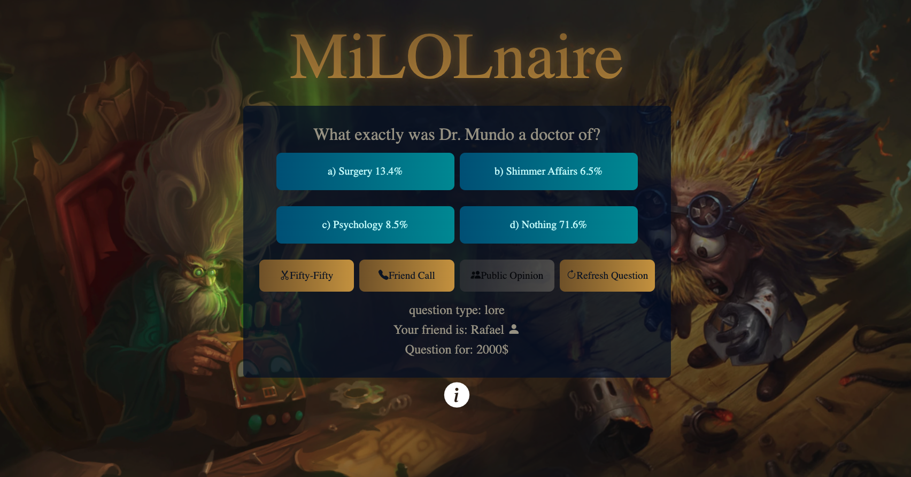

# Millionaires  - Django Web Application

**Millionaires** is a web application built using Django, inspired by the popular quiz game "Who Wants to Be a Millionaire?". However, this version focuses entirely on questions related to the popular game **League of Legends**. Players can use standard lifelines to help them answer challenging questions.

The application was deployed on Google Cloud Platform (GCP) and was hosted at [milolnaire.pl](https://milolnaire.pl) (though it may no longer be live).

## Features

- **Quiz Gameplay**: Play the quiz with questions about **League of Legends**.
- **Lifelines**: The game includes standard lifelines such as:
  - **50:50** (removes two wrong answers)
  - **Phone a friend** (gets a hint)
  - **Ask the audience** (community suggestion)
  - **New question** (change current question to another one)
- **Django Backend**: The application is powered by Django and uses **SQLite** as the database to store questions and user data.
- **Responsive Design**: The game is designed to work on both desktop and mobile devices.

## Database

The project uses **SQLite** for its database, storing:
- Questions
- Answers

Player current state is stored in session.

## Setup

### Prerequisites
Before you start, make sure you have the following installed:
- Python 3.6+
- Django 3.x or later

### Installation Steps

1. **Clone the repository**:

   ```
   git clone https://github.com/HOZY39/milolnaire.git
   cd milolnaire
   ```
2. **Create a virtual environment (optional but recommended)**:
   ```
    python -m venv venv
    source venv/bin/activate  # On Windows, use `venv\Scripts\activate`
    ```
   On windows, use:
   ```
    python -m venv venv
    venv\Scripts\activate
    ```
3. **Install dependencies**:
   ```
    pip install -r requirements.txt
    ```
4. **Database**:

   Sadly, You must manage database on your own.
6. **Run the development server**:
   ```
    python manage.py runserver
    ```
Now, you can access the application at http://localhost:8000.

## Hosting and Deployment

The application was hosted on Google Cloud Platform (GCP), but may not be live anymore.


<table>
  <tr>
    <td>
      <a href="img_readme/1.png">
        
      </a>
    </td>
    <td>
      <a href="img_readme/2.png">
        
      </a>
    </td>
    <td>
      <a href="img_readme/3.png">
        
      </a>
    </td>
  </tr>
  <tr>
    <td>
      <a href="img_readme/4.png">
        
      </a>
    </td>
    <td>
      <a href="img_readme/5.png">
        
      </a>
    </td>
    <td>
      <a href="img_readme/6.png">
        
      </a>
    </td>
  </tr>
  <tr>
    <td>
      <a href="img_readme/7.png">
        
      </a>
    </td>
    <td>
      <a href="img_readme/8.png">
        
      </a>
    </td>
  </tr>
</table>
